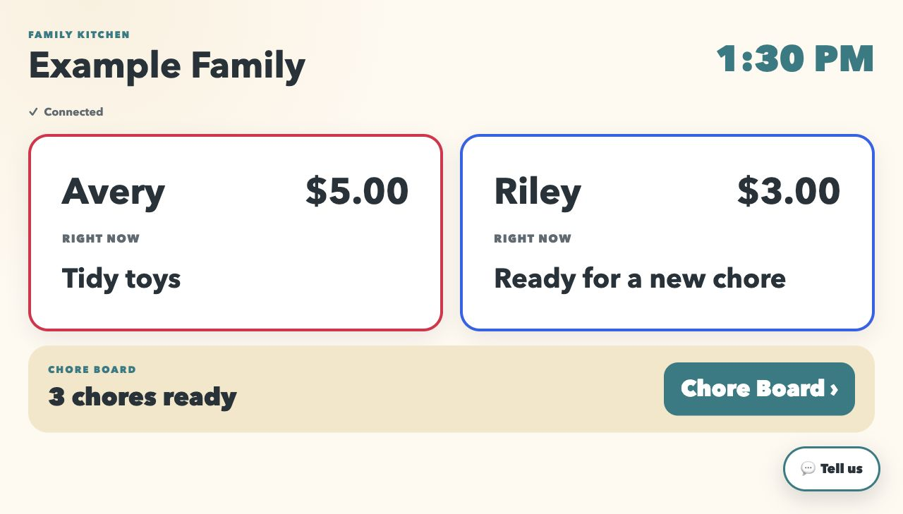
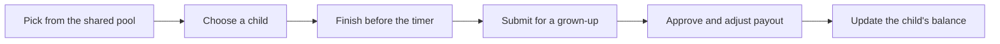
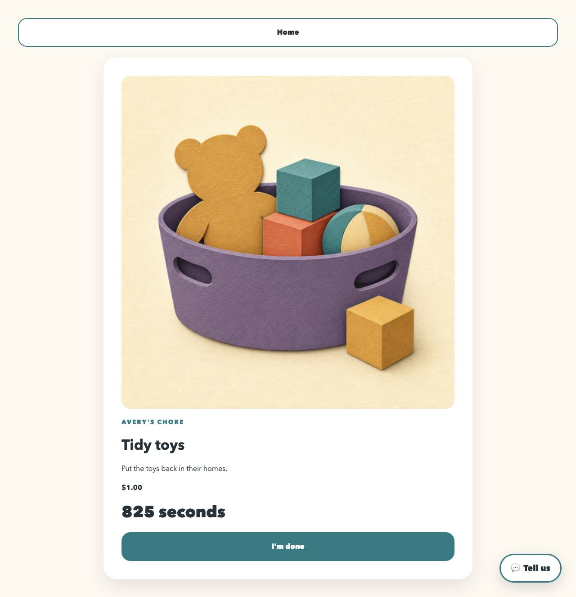

  

<h1 align="center">Managed Mischief</h1>

  <strong>A local-first family command center for chores, rewards, and the everyday chaos in between.</strong>

  
  
  
  
  

Managed Mischief brings a touch-friendly kitchen dashboard, native-style parent apps, and a self-hosted family server into one household system. Children can pick chores from a shared pool and see their rewards; parents keep control of approvals, payouts, and balance adjustments.

<em>The Raspberry Pi dashboard, populated with the fictional Example Family development fixture.</em>

> [!CAUTION]
> **LAN-only today.** The development authenticator is not approved for public ingress. Do not expose the API or dashboard through Cloudflare Tunnel, port forwarding, or another public route until production authentication is implemented.

## One family system, three surfaces

| Surface               | Built for                              | What it does                                                                                                                                      |
| --------------------- | -------------------------------------- | ------------------------------------------------------------------------------------------------------------------------------------------------- |
| **Kitchen dashboard** | Children on a Raspberry Pi touchscreen | Shows balances and chore status, offers the shared chore pool, runs completion timers, and submits finished chores for approval.                  |
| **Parent app**        | Parents on iPhone and Android          | Manages chore templates and the shared pool, reviews submissions, adjusts payouts, records purchases/corrections, and reviews household feedback. |
| **Home server**       | Ubuntu on your own hardware            | Keeps household data, permissions, chore state, approvals, and the append-only reward ledger local.                                               |

## The chore loop

- Chores have pictures, instructions, default dollar values, and time limits.
- A claimed chore leaves the shared pool; an expired claim returns automatically.
- Completion never pays a child directly. A parent must approve or reject it.
- Parents can change the final payout during approval.
- Purchases and corrections become ledger entries, so every balance change has a history.

## Kid-sized by design

The kitchen experience favors large targets, clear language, warm visuals, and as few decisions as possible. Children do not need phones or individual accounts for the initial release.

  

<em>A child can see exactly what to do, what it is worth, and how much time remains.</em>

## What works today

- Shared chore templates and a published chore pool
- Touchscreen chore claiming, countdowns, expiration, and completion submission
- Parent approval inbox with adjustable payouts and rejection handling
- Child reward balances backed by an append-only transaction ledger
- Parent-recorded purchases and balance corrections
- Offline-aware parent and dashboard clients
- A privacy-conscious feedback loop with parent review before any GitHub handoff
- Deterministic fictional fixtures and an end-to-end local browser journey

## Roadmap

The foundation is deliberately local and narrow. The most useful next layers are:

### Next: safe daily use

- Production parent authentication and revocable dashboard pairing
- Secure remote access at `family.jordanwaters.net`
- Push notifications and deep links for chores awaiting approval
- Raspberry Pi kiosk setup, health checks, backup guidance, and in-app troubleshooting

### Then: the family command center

- Read-only Google Calendar sync with child and family calendar mapping
- Savings goals, celebrations, streaks, and family quests
- Better household scheduling and morning/evening routines
- Installable app builds and smoother onboarding for both parents

### Later: a smarter home companion

- Optional Home Assistant webhooks for chore and reward events
- Voice shortcuts through Home Assistant or Google
- Photo proof when children have access to a camera-equipped device
- Deeper automations without making Home Assistant a core dependency

Have an idea that belongs here? Open an issue—or use the app's feedback flow, where a parent can scrub the report before handing it off to GitHub.

## Technology

- **Clients:** React, React Native, Expo, Vite, and an installable PWA
- **Server:** Node.js, Fastify, PostgreSQL, and Drizzle
- **Shared code:** TypeScript contracts, API client, design tokens, and chore imagery
- **Quality:** Vitest, Jest, Testing Library, Playwright, Testcontainers, ESLint, and Prettier

## Repository map

- `apps/api` — household data, chore workflow, approvals, reward ledger, setup diagnostics, and feedback intake
- `apps/dashboard` — the touch-first kitchen display
- `apps/parent` — the native-style iOS and Android parent application
- `packages/*` — shared contracts, client code, design tokens, domain helpers, and chore images
- `db/migrations` — the PostgreSQL schema history
- `e2e` — the full child-to-parent approval journey

## Run it locally

Use Node.js 24, pnpm 11, PostgreSQL, and a Docker-compatible local runtime. The [local development and Raspberry Pi preview runbook](./docs/development/client-vertical-slice.md) walks through database setup, fictional seed data, the parent app, and the kitchen dashboard.

The intended public hostname is `family.jordanwaters.net`, but public ingress remains disabled until the authentication milestone is complete.

## Contributing

Managed Mischief is being built in public. Contributions are especially welcome around:

- friendly, accessible family UX
- Raspberry Pi kiosk reliability
- self-hosting, networking, backups, and secure ingress
- Home Assistant integrations
- mobile testing and release automation
- privacy and security review

Please open an issue before starting a large change so the direction stays coherent. Small fixes and documentation improvements can go straight to a focused pull request.

## Privacy

Screenshots and committed examples use only the deterministic fictional Example Family fixture. Real household information belongs exclusively in ignored local configuration and the local database.

Read the [public-source privacy guide](./docs/development/public-source-privacy.md) before contributing or auditing a release. Run `pnpm verify:public-source-privacy` before publishing changes.
